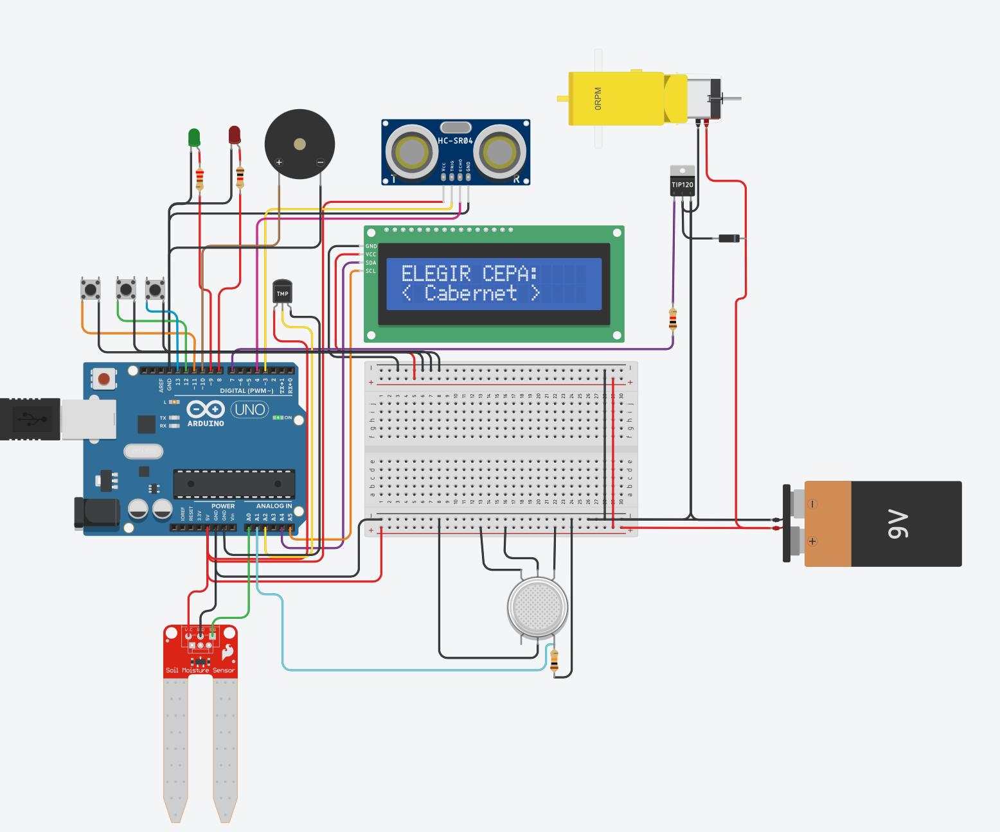
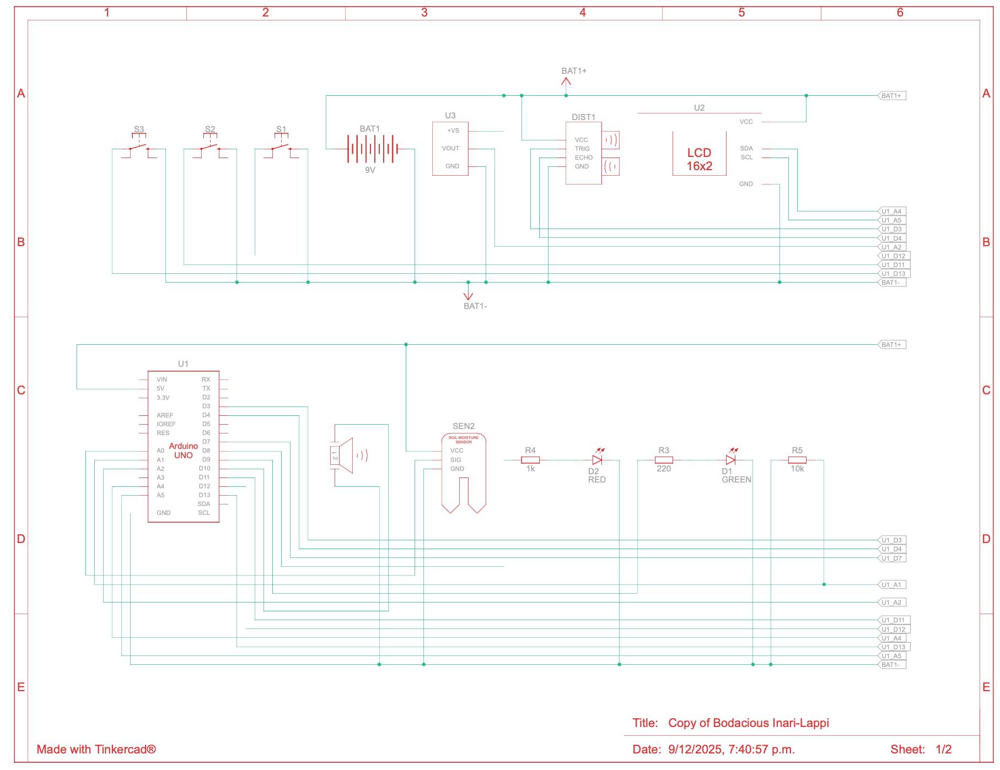
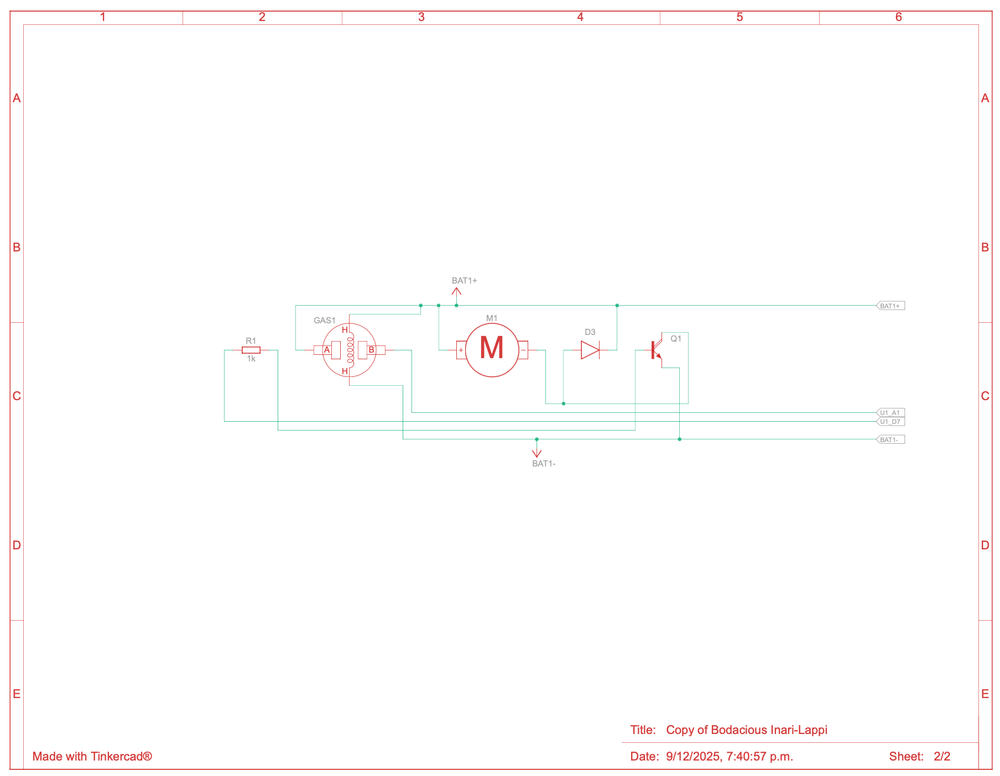

# 🍇 Vinisys: Simulación IoT para Viticultura

Diseño lógico y validación de prototipo para un sistema de monitoreo ambiental en viñedos.

## 📐 Descripción del Proyecto
Este repositorio aloja la **ingeniería y validación** del sistema Vinisys. Antes de la implementación física, se utilizó simulación para validar:
* La lógica de control del microcontrolador.
* La seguridad del circuito de potencia.
* La interfaz de usuario (LCD).

## 🛠️ Tecnologías (Simulación)
* **Software:** Autodesk Tinkercad.
* **Hardware Simulado:** Arduino Uno (Atmega328P).
* **Sensores:** Temperatura (TMP36), Distancia (Ultrasonido), Gas (Simulado).
* **Actuadores:** Motor DC (Ventilación automática), Pantalla LCD 16x2.

## ⚡ Planos Esquemáticos
El diseño se divide en dos etapas para proteger el microcontrolador de ruidos eléctricos y picos de voltaje del motor.

| Etapa de Control (Lógica) | Etapa de Potencia (Actuadores) |
|:---:|:---:|
|  |  |
*Diagramas esquemáticos generados en Tinkercad.*

## 🔐 Enfoque de Seguridad (Security by Design)
Aunque es un entorno simulado, el diseño considera principios de seguridad para su futura implementación física:
1. **Aislamiento de Hardware:** Uso de transistores y diodos (ver *Etapa de Potencia*) para evitar retornos de corriente que dañen la unidad lógica.
2. **Validación de Entradas:** El sistema previene estados inconsistentes en el menú de selección de cepas.

---
*Este proyecto demuestra la capacidad de diseñar, diagramar y validar sistemas embebidos antes del despliegue físico.*
